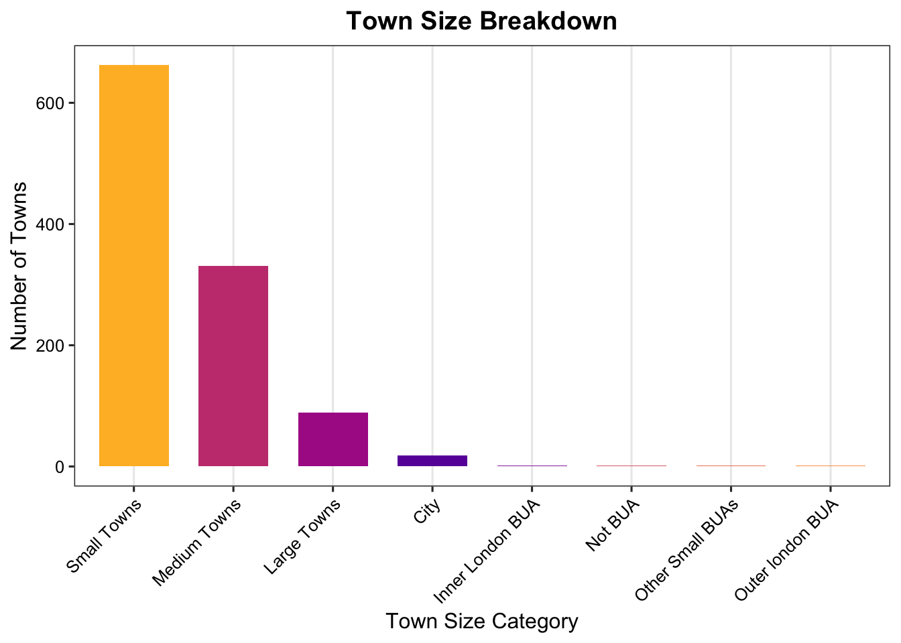
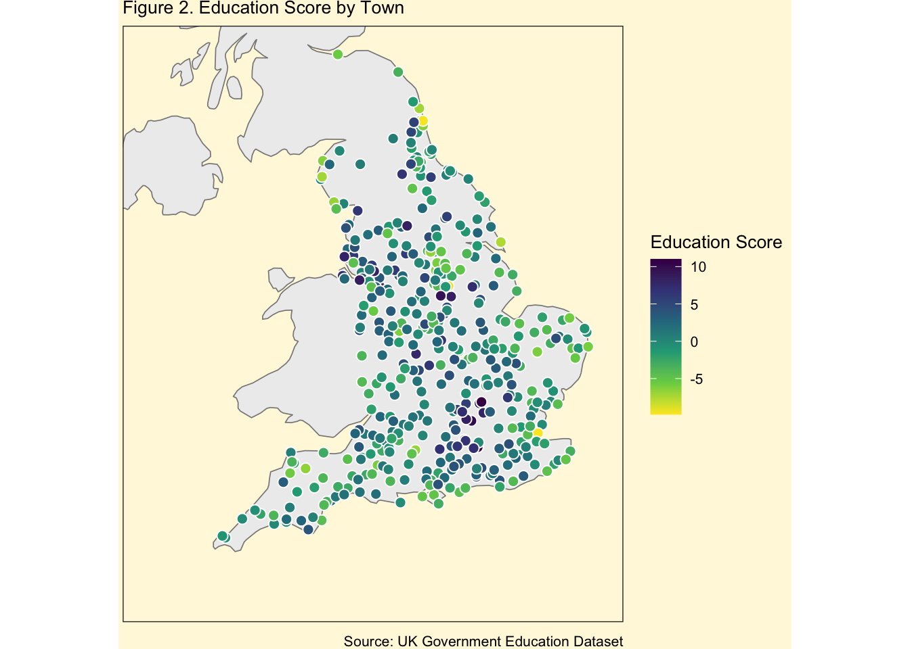

## Problem Introduction
::: {.bounding-box-intro .smaller-text}
- Education outcomes vary significantly across the UK, often tied to geographic and socio-economic factors.
- We explore whether characteristics like town size, population, and location influence young people’s access to higher education.
- Focus is on participation in full-time higher education at ages 19 and 22.
- The goal: Identify which town-level factors predict better education outcomes and where policy support might be needed.
:::

## Dataset Description
::: {.bounding-box-description}
- Based on UK Census and Department for Education data.
- 1,100+ towns, grouped by size: Cities, Large, Medium, Small.
- Variables include education score at 22, qualification level, and full-time education at 19.
- Additional indicators: population, parental employment, household income proxies, and region.
:::

## Methodology
::: {.bounding-box-methods .smaller-text}
- Data was cleaned, standardized, and grouped by town.
- Tools used: `dplyr`, `ggplot2`, `tidymodels`.
- Analytical methods:
  - Correlation + Linear regression for continuous education scores.
  - Logistic regression and feature importance for full-time education likelihood at age 19.
- Aim: Find which variables are most predictive and how they vary by geography.
:::

## Results: Town Size & Education Score

:::: {.bounding-box-results-1 .smaller-text}

::: {.slide-flex}

::: {.left}
- Larger towns tend to have better average education scores by age 22.  
- Towns near urban centers show stronger outcomes, likely due to proximity to universities and better resources.
:::

::: {.right}

:::

:::

::::

## Results: Predictors & Regional Disparities {.smaller-heading}

::: {.bounding-box-results-3 .smaller-text}

::: {.slide-flex}

::: {.left}
- **Most Predictive Factors:**
  - Parental education level
  - Parental employment
  - Household income proxy
  - Region (South East & London)

- **Interpretation:**
  Stable, educated households increase the likelihood of higher education.
  
- **Regional Outcomes:**
  Southern areas outperform; northern/coastal towns lag behind, revealing persistent geographic inequalities.
:::

::: {.right}
{width="85%"}
:::

:::

:::

